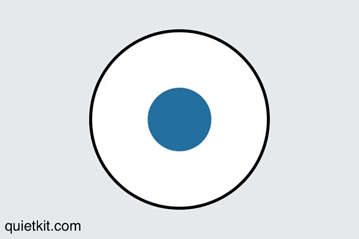

## Breathing technique

### Navy seals technique

1. inhale for 4 seconds (as the circle expands)
2. hold your lungs full of air for 4 seconds (as the circle stays fully expanded)
4. then exhale for 4 seconds (as the circle shrinks)
3. hold your lungs empty for 4 seconds (as the circle is contracted)

You can repeat this process (as detailed here) as many times as you need until you feel calm. Then get back to coding!
